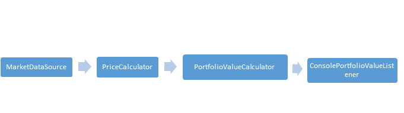

# Portfolio Value Engine

The basic architecture of this project is based on Unary pub-sub. THe problem has been broken down into several classes,
each of which is a unary pub-sub. This is linked together using a chained pipeline of handlers:

## External libraries used

'org.jetbrains:annotations:20.1.0'
'org.jetbrains:annotations:20.1.0'
'org.junit.jupiter:junit-jupiter-api:5.8.2'
'org.junit.jupiter:junit-jupiter-engine:5.8.2'
"com.google.guava:guava:12.0.1"
'com.opencsv:opencsv:3.7'
'org.mockito:mockito-core:4.3.1'
'org.xerial:sqlite-jdbc:3.36.0.3'
'commons-io:commons-io:2.6'

## Running demo

Sample data is setup in main. For demo purposes, main can be run to visualize the output.